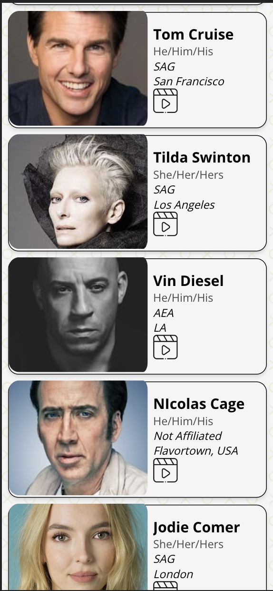

## Welcome to Cast!

 

### <i>A better way for Casting Directors to get paired up with production talent.</i>

 

This app was born out of a desire to optimize a very manual casting process. Instead of sifting through resumes one by one, Cast allows Talent to setup a profile and have Casting Directors reach out to them. It's more simple, streamined, and modern. 

## Getting Started

- <a href="https://castapp.netlify.app/">Here</a> is a link to the deployed application. 
- <a href="https://trello.com/b/wsoBthTD/team-board-unit-3-project">Here</a> is a link to the the app's planning materials. 

## Features

- Streamlined user experience flow.
- Separate Talent and Casting director profiles.
- The ability to share things like headshots, a demo reel, and important details with casting directors.
- Our powerful search tool allows talent to connect with others for networking purposes and Casting Directors to filter search results with relevant criteria to making a casting decision.
- Casting directors can create lists to reference back to (i.e. Great Comedic Actors, or Professional Stuntmen).

## Technology

- React
- Javascript
- HTML
- Mongoose
- Node.js
- Express.js
- Netlify
- Fly.io

## Future Enhancements

 - Talent will be able to share availability with Casting Directors right in the app. 
 - Direct messages. 
 - Process casting contracts to make the entire casting process digial and centralized. 
 - Talent will be able to add special skills to their profile for casting directors to easily search for the right person for the job.